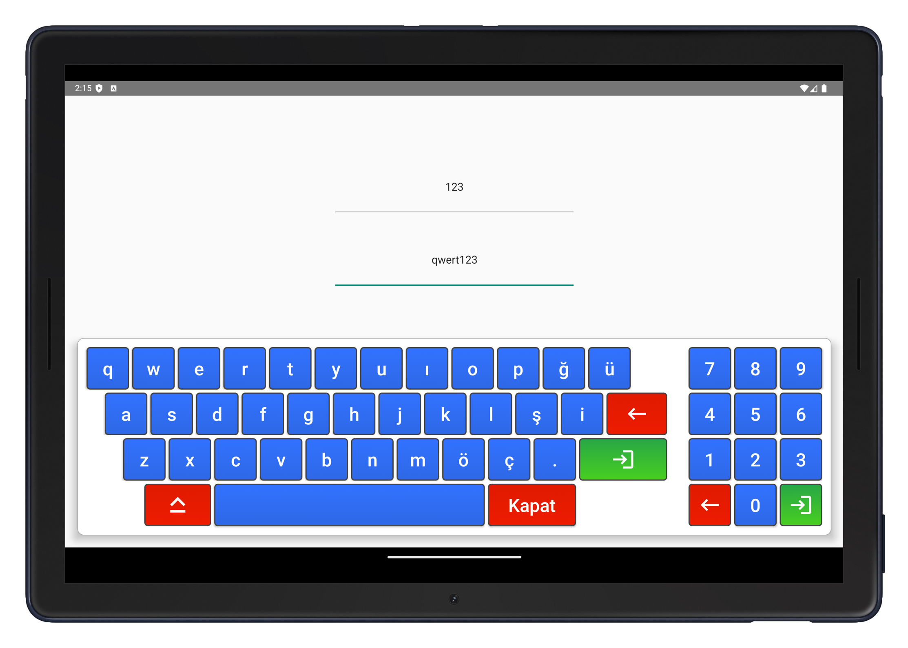

# Popup Keyboard and Numpad for Android Tablets

This project was developed during my internship as a simple solution for tablet applications requiring custom input. It was one of my first projects as I was new to coding, and it features a **popup keyboard** and a **popup numpad**, both implemented using the `PopupWindow` class in Android. 

The project serves as a nostalgic reference to my early development experience and demonstrates how lightweight popup-based input components can be created for Android tablet applications.


## Features

- **Full Keyboard**: A complete alphanumeric keyboard displayed in a popup window.
- **Numpad**: A separate numeric keypad for number inputs, also shown in a popup window.
- Custom input handling for seamless interaction with text fields.

## Screenshots

### Full Keyboard


### Numpad


## How It Works

1. **PopupWindow Usage**: Both the keyboard and numpad are implemented using Android's `PopupWindow`, allowing them to overlay the existing UI without disrupting it.
2. **Custom Layouts**: XML layouts define the structure of the keyboard and numpad, enabling easy customization.
3. **Event Handling**: Button clicks are handled to inject text input directly into the target `EditText` or other input fields.

## Project Structure

- `PopupKeyboard.java`: Contains the implementation for the full keyboard.
- `PopupNumpad.java`: Contains the implementation for the numpad.
- `res/layout`: Includes the XML files for the keyboard and numpad designs.

## Why Share This Project?

This project is not production-grade but rather a simple prototype that showcases:
- How to use `PopupWindow` effectively in Android.
- How to create custom input methods for niche use cases.
- My early journey as a developer during my internship.

## Getting Started

1. Clone the repository:
   ```bash
   git clone https://github.com/azadkiziltas/AndroidCustomKeyboardJava.git
   ```
2. Import the project into Android Studio.
3. Build and run the project on a tablet emulator or physical device.

## License

This project is shared for educational purposes and nostalgia. Feel free to use it for learning or experimentation.
